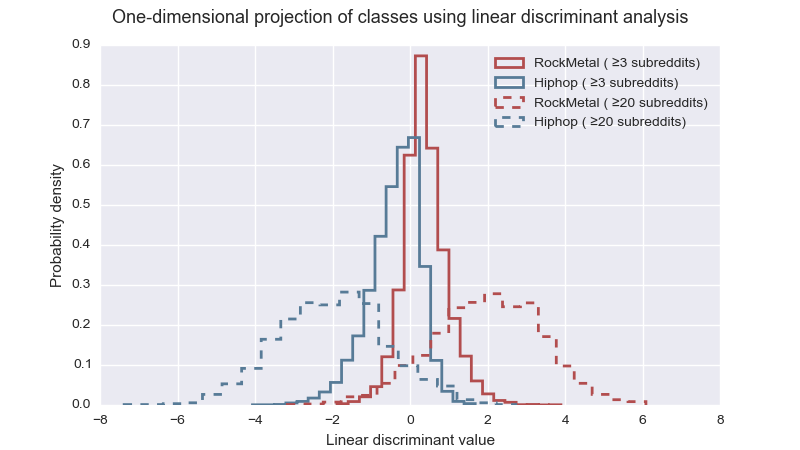

# Reddit Music Fans

Predicting music tastes from unrelated interests. A small data science project.

## Introduction

**Aim:**

* Classify music fans on Reddit by their preferred music genre, based on which subreddits (Reddit subforums) _unrelated to music_ the user contributed to.
  * A _fan_ is defined as a user who posted in subreddits related to one genre and not in subreddits of other genres.
  * To keep to two outcomes, fans labelled as **Hiphop** and **RockMetal** are classified, though **Classical** and **Electronic** were also tracked.
* Use the model to learn about Reddit communities. Therefore, **interpretability takes precedence** over prediction accuracy.

**Data source**: Reddit user Stuck_In_the_Matrix [made available](https://www.reddit.com/r/datasets/comments/3bxlg7/i_have_every_publicly_available_reddit_comment/) a database of every public Reddit comment. Kaggle picked up on this and are hosting the [comments from May 2015](https://www.kaggle.com/c/reddit-comments-may-2015), which was used here.

**Coding tools:** Python 2 with modules numpy, scipy, scikit-learn, sqlite3 and matplotlib. Vim with tmux. IPython.

## Files

* **main.py** - Driver. In its current state, will produce the graphical output in this README.
* **get_dataset_SQL.py** - Functions to create the X, Y database from SQL source.
* **manipulate_data.py** - Post-processing tools for the X, Y arrays.
* **subreddits.py** - Music subreddits by genre and exclusion list of all music subreddits.
* **music_2000offtopic.pickle** - Serialisation of the X, Y arrays and predictor labels (subreddit names) from SQL.

## Data exploration

The SQL source has 54,504,410 rows, and each is a unique comment. The columns are comment attributes, including user name and subreddit. After significant data processing, an array of predictors `X` was produced. Its rows are music fans, and its columns are subreddits unrelated to music. Each cell takes a boolean value; `True` if the fan posts in the subreddit. `Y` records the outcomes; each fan's preferred genre.

The data is noisy, highly correlated and sparse. There are approximately 47,000 fans of the two genres. To balance the two classes, the RockMetal class was slightly under-sampled. The top 2000 subreddits were tracked as predictors. The average user posted in <1% of these.

### Low-dimensional visualisation

Below, the data is shown projected onto a single component, found by Linear Discriminant Analysis (LDA). Two datasets are shown: one for fans who posted in at least 3 off-topic subreddits, and another for fans who posted in at least 20. The 'at least 3' set has 12,829 fans per class, but the 'at least 20' set has just 1,795.

The class distributions have a single mode and are approximately Gaussian. Restricting the input to users who contributed to at least 20 different off-topic subreddits increases the separation of the distributions drastically.

### Non-predictive predictors and collinearity
